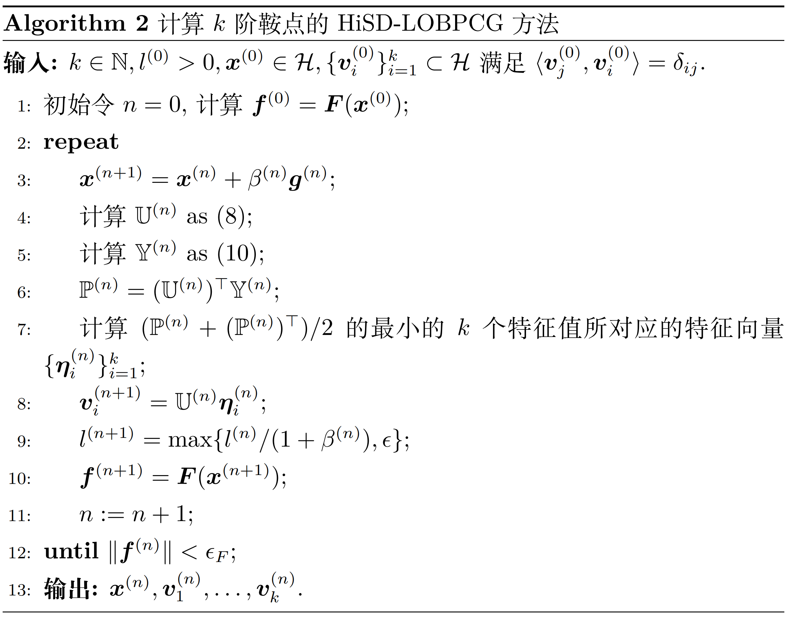

# 1 什么是 $k$ 阶鞍点

  给定一个在实希尔伯特空间 $\mathcal{H}$ 上定义的二次Fréchet可微的能量泛函
$E(\boldsymbol{x})$，其内积为 $\langle \cdot,\cdot \rangle$，我们令
$\boldsymbol{F}(\boldsymbol{x})=-\nabla E(\boldsymbol{x})$
表示其自然力，$\mathbb{G}(\boldsymbol{x}) =\nabla^2E(\boldsymbol{x})$
表示其Hessian矩阵。

-   如果 $\lVert \boldsymbol{F}(\boldsymbol{\hat{x}}) \rVert =0$，则称
    $\boldsymbol{\hat{x}}\in\mathcal{H}$ 为 $E(\boldsymbol{x})$
    的一个临界点。

-   一个不是局部极值的 $E(\boldsymbol{x})$ 的临界点被称为
    $E(\boldsymbol{x})$
    的一个鞍点。特别的，有些时候我们也把局部极小值称为 $0$
    阶鞍点，局部极大值称为 $d$（系统维度）阶鞍点。

-   如果 $\mathbb{G}(\boldsymbol{\hat{x}})$ 有一个有界逆，则称临界点
    $\boldsymbol{\hat{x}}$ 为非退化的。

-   根据Morse理论，非退化临界点 $\boldsymbol{\hat{x}}$
    的指数（Morse指数）是使得 $\mathbb{G}(\boldsymbol{\hat{x}})$
    为负定的最大子空间 $\mathcal{K}$
    的维数。我们的目标是找到势能面上的指数为 $k$ 的鞍点，简称为
    $k$-saddle 或 $k$ 阶鞍点。

-   为简便起见，我们假设 $\mathcal{H}$ 的维数为 $d$，并将内积
    $\langle \boldsymbol{x},\boldsymbol{y} \rangle$ 写为
    $\boldsymbol{x}^{\top}\boldsymbol{y}$。

  下面先从特征值和特征向量的角度给一个鞍点阶数的直观理解，便于之后问题的开展。

  我们注意到Hessian矩阵是实对称矩阵（用到前面的二次Fréchet可微），其正交相似于一个对角矩阵，即存在正交矩阵
$\mathbb{T}$ 和对角矩阵 $\mathbb{D}$ 使得
$\mathbb{T}^{-1}\mathbb{G}(\boldsymbol{\hat{x}})\mathbb{T}=\mathbb{D}$。
事实上这个对角矩阵的对角线上各个元素即为该实对称矩阵的特征值
$\hat{\lambda}_1,\hat{\lambda}_2,\ldots,\hat{\lambda}_d$， 且不妨
$\hat{\lambda}_1\leq\hat{\lambda}_2\leq\ldots\leq\hat{\lambda}_d$，并设此时
$\mathbb{T}$ 的列向量为
$\boldsymbol{\hat{v}}_1,\boldsymbol{\hat{v}}_2,\ldots,\boldsymbol{\hat{v}}_d$。

  可以证明，对于非退化临界点 $\hat{x}$，若
$$
\hat{\lambda}_1\leq\ldots\leq\hat{\lambda}_k<0<\hat{\lambda}_{k+1}\leq\ldots\leq\hat{\lambda}_d
$$
，则
$k$ 即为该鞍点的阶数。 一方面，$\mathbb{G}(\boldsymbol{\hat{x}})$ 在
$$
\boldsymbol{\hat{v}}_1,\boldsymbol{\hat{v}}_2,\ldots,\boldsymbol{\hat{v}}_k
$$
生成的子空间 $\hat{\mathcal{V}}$ 上是负定的，故 $\boldsymbol{\hat{x}}$
至少为 $k$ 阶； 另一方面，对于 $\mathcal{H}$ 的任意一个 $k+1$ 维子空间
$\mathcal{K'}$，有
$$
\boldsymbol{\hat{v}}_{k+1},\ldots,\boldsymbol{\hat{v}}_d
$$
生成的子空间
$\hat{\mathcal{V}}^{\perp}$ 与 $\mathcal{K'}$ 交非零（否则 $\mathcal{K'}$ 中添上
$$
\boldsymbol{\hat{v}}_{k+1},\ldots,\boldsymbol{\hat{v}}_d
$$
生成 $d+1$ 维空间，矛盾！）。 取交集中一个非零元素

$$
\boldsymbol{w}=\displaystyle \sum_{i=k+1}^{d} a_i\boldsymbol{\hat{v}}_i
$$

则有

$$
\boldsymbol{w^{\top}\mathbb{G}(\hat{x})w}=\displaystyle \sum_{i=k+1}^{d} a_i\boldsymbol{\hat{v}}_i^{\top}\sum_{i=k+1}^{d} \hat{\lambda}_ia_i\boldsymbol{\hat{v}}_i
=\displaystyle \sum_{i=k+1}^{d} \hat{\lambda}_ia_i^2>0
$$

故
$\mathbb{G}(\boldsymbol{\hat{x}})$ 在 $\mathcal{K'}$ 上不是负定的，即
$\boldsymbol{\hat{x}}$ 的阶数为 $k$。
事实上，如果熟悉实对称矩阵的合同标准型的话，可以
发现这里所说的阶其实也就是Hessian矩阵的负惯性指数。

# 2 将寻找 $k$ 阶鞍点转化为优化问题

  沿用上面的符号，注意到 $\mathbb{G}(\boldsymbol{\hat{x}})$ 在
$\hat{\mathcal{V}}$ 上是负定的，在其正交补 $\hat{\mathcal{V}}^{\perp}$
上是正定的，这意味着 $\boldsymbol{\hat{x}}$ 是线性流形
$\boldsymbol{\hat{x}} + \hat{\mathcal{V}}$
上的局部极大值，同时也是线性流形
$\boldsymbol{\hat{x}} + \hat{\mathcal{V}}^{\perp}$ 上的局部极小值。

  考虑
$\boldsymbol{\hat{x}}\_{\hat{\mathcal{V}}}, \boldsymbol{\hat{x}}\_{\hat{\mathcal{V}}^{\perp}}$
分别为 $\boldsymbol{\hat{x}}$ 在 $\hat{\mathcal{V}}, \hat{\mathcal{V}}^{\perp}$ 上的投影，则
$(\boldsymbol{v}, \boldsymbol{w}) = (\boldsymbol{\hat{x}}_{\hat{\mathcal{V}}}, \boldsymbol{\hat{x}}\_{\hat{\mathcal{V}}^{\perp}})$
是 minimax 问题

$$
\min_{\boldsymbol{w}\in\hat{\mathcal{V}}^{\perp}} \max_{\boldsymbol{v}\in\hat{\mathcal{V}}} E(\boldsymbol{v} + \boldsymbol{w})
$$

的一个解。但是，这并不是一个经典的 minimax 问题，因为空间 $\hat{\mathcal{V}}$ 是未知的，所以在求解优化问题的过程中我们的迭代法应该包括两个部分：一个是更新
$\boldsymbol{v}$ 和 $\boldsymbol{w}$（在这个问题中也就是更新
$\boldsymbol{x} = \boldsymbol{v} + \boldsymbol{w}$ ），还有一个就是要更新空间
$\mathcal{V}$（ $\mathcal{V}$ 用于近似 $\hat{\mathcal{V}}$ ，一般用当前
$\boldsymbol{x}$ 处 Hessian 矩阵的最小 $k$ 个特征值对应的特征向量张成的子空间来描述）。

# 3 $\boldsymbol{x}$ 的动力学

  更新 $\boldsymbol{x}$ 直观上看是让 $\boldsymbol{\dot{x}}$ 在空间
$\mathcal{V}$ 上的投影 $\mathcal{P}\_{\mathcal{V}}\boldsymbol{\dot{x}}$
为能量函数 $E(\boldsymbol{x})$ 的上升方向， 而在其补空间
$\mathcal{V}^{\perp}$ 上的投影
$\mathcal{P}_{\mathcal{V}^{\perp}}\boldsymbol{\dot{x}}$ 为下降方向。

  特别地，注意到自然力
$\boldsymbol{F}(\boldsymbol{x})=-\nabla E(\boldsymbol{x})$
为最速下降方向， 故可以考虑令

$$
\mathcal{P}_{\mathcal{V}}\boldsymbol{\dot{x}}=-\mathcal{P}_{\mathcal{V}}\boldsymbol{F}(\boldsymbol{x})
$$

以及

$$
\mathcal{P}_{\mathcal{V}^{\perp}}\boldsymbol{\dot{x}}=\mathcal{P}_{\mathcal{V}^{\perp}}\boldsymbol{F}(\boldsymbol{x})=\boldsymbol{F}(\boldsymbol{x})-\mathcal{P}_{\mathcal{V}}\boldsymbol{F}(\boldsymbol{x})
$$

再取两个正的松弛常数 $\beta_{\mathcal{V}}$ 和 $\beta_{\mathcal{V}^{\perp}}$ 即可以给出 $\boldsymbol{x}$ 的动力学

$$
\boldsymbol{\dot{x}}=\beta_{\mathcal{V}}(-\mathcal{P}_{\mathcal{V}}\boldsymbol{F}(\boldsymbol{x}))+\beta_{\mathcal{V}^{\perp}}(\boldsymbol{F}(\boldsymbol{x})-\mathcal{P}_{\mathcal{V}}\boldsymbol{F}(\boldsymbol{x}))
$$

进一步，如果简单地令
$\beta_{\mathcal{V}}=\beta_{\mathcal{V}^{\perp}}=\beta$ 则上式化为

$$
\beta^{-1}\boldsymbol{\dot{x}}=\boldsymbol{F}(\boldsymbol{x})-2\mathcal{P}_{\mathcal{V}}\boldsymbol{F}(\boldsymbol{x})
\tag{1}
$$ 

特别地，如果给出空间
$\mathcal{V}$ 的一组标准正交基
$\boldsymbol{v_1},\boldsymbol{v_2},\ldots,\boldsymbol{v_k}$ 则有投影变换
$\mathcal{P}\_{\mathcal{V}}=\displaystyle \sum_{i=1}^{k}\boldsymbol{v}_i\boldsymbol{v}^{\top}_i$
从而公式
(1) 化为

$$
\beta^{-1}\boldsymbol{\dot{x}}=\left(\mathbb{I}-2\displaystyle \sum_{i=1}^{k}\boldsymbol{v}_i\boldsymbol{v}^{\top}_i\right)\boldsymbol{F}(\boldsymbol{x})
\tag{2}
$$ 

其中 $\mathbb{I}$ 为单位矩阵。

# 4 $\mathcal{V}$ 的演化

  我们的目标是用 $\mathcal{V}$ 来近似 $\hat{\mathcal{V}}$，注意到
$\hat{\mathcal{V}}$ 是由 $\mathbb{G}(\boldsymbol{\hat{x}})$ 的 $k$
个最小特征值对应的特征向量生成的子空间，于是我们可以考虑把
$\mathbb{G}(\boldsymbol{x})$ 的 $k$
个最小特征值对应的特征向量生成的子空间作为 $\mathcal{V}$。

## 4.1 基本方法：转化为带约束优化问题后用拉格朗日函数的梯度流构造动力学

先看最简单的情况，如何找最小特征值及其对应的特征向量？我们可以通过求解带约束问题

$$
\min_{\boldsymbol{v}_1} \langle \boldsymbol{v}_1,\mathbb{G}(\boldsymbol{x})\boldsymbol{v}_1 \rangle \hspace{4em} \text{s.t.} \hspace{1em} \langle \boldsymbol{v}_1,\boldsymbol{v}_1 \rangle=1
$$

来实现。

类似地，在给出
$\boldsymbol{v_1},\boldsymbol{v_2},\ldots,\boldsymbol{v_{i-1}}$
的情况下，想要求第 $i$
小的特征值及其对应的特征向量则可以考虑求解带约束优化问题

$$
\min_{\boldsymbol{v}_i} \langle \boldsymbol{v}_i,\mathbb{G}(\boldsymbol{x})\boldsymbol{v}_i \rangle \hspace{4em} \text{s.t.} \hspace{1em} \langle \boldsymbol{v}_i,\boldsymbol{v}_j \rangle=\delta_{ij} \hspace{1em}
j=1,2,\ldots,i
\tag{3}
$$

其中

$$
\delta_{ij}=
\begin{cases}
    1 & \text{如果 } i=j \\
    0 & \text{如果 } i \neq j 
\end{cases}
$$ 

我们考虑这一系列带约束优化问题的动力学，考虑拉格朗日函数

$$
\mathcal{L}_i(\boldsymbol{v}_i;\xi^{(i)}_1,\ldots,\xi^{(i)}_{i-1},\xi^{(i)}_i)=\langle \boldsymbol{v}_i,\mathbb{G}(\boldsymbol{x})\boldsymbol{v}_i \rangle-\xi^{(i)}_i(\langle \boldsymbol{v}_i,\boldsymbol{v}_i \rangle-1)-\displaystyle \sum_{j=1}^{i-1}\xi^{(i)}_j\langle \boldsymbol{v}_i,\boldsymbol{v}_j \rangle
$$

关于 $\boldsymbol{v}_i$ 求梯度得

$$
\frac{\partial}{\partial \boldsymbol{v}_i}\mathcal{L}_i(\boldsymbol{v}_i;\xi^{(i)}_1,\ldots,\xi^{(i)}_{i-1},\xi^{(i)}_i)=2\mathbb{G}(\boldsymbol{x})\boldsymbol{v}_i-2\xi^{(i)}_i\boldsymbol{v}_i-\displaystyle \sum_{j=1}^{i-1}\xi^{(i)}_j\boldsymbol{v}_j
$$

取松弛常数 $\gamma>0$，可得由拉格朗日函数的梯度流给出的
$\boldsymbol{v_i}$ 的动力学（含待定系数） 

$$
\begin{aligned}
\boldsymbol{\dot{v}}_i
&=-\frac{\gamma}{2}\frac{\partial}{\partial \boldsymbol{v}_i}\mathcal{L}_i(\boldsymbol{v}_i;\xi^{(i)}_1,\ldots,\xi^{(i)}_{i-1},\xi^{(i)}_i) \nonumber \\
&=-\gamma(\mathbb{G}(\boldsymbol{x})\boldsymbol{v}_i-\xi^{(i)}_i\boldsymbol{v}_i-\displaystyle \frac{1}{2}\sum_{j=1}^{i-1}\xi^{(i)}_j\boldsymbol{v}_j)
\end{aligned}
\tag{4}
$$

这里前面乘 $-\frac{\gamma}{2}$ 而非 $-\gamma$
是为了之后的表达式更加简洁。 接下来我们的目的是确定各个
$\xi_i$，注意到等式约束条件

$$
c^{(i)}_i(t)=\langle \boldsymbol{v}_i,\boldsymbol{v}_i \rangle-1=0
$$

$$
c^{(i)}_j(t)=\langle \boldsymbol{v}_i,\boldsymbol{v}_j \rangle=0 \hspace{1em}
j=1,2,\ldots,i-1
$$ 

在初值符合等式约束的情况下即要求：

$$
\dot{c}^{(i)}_i(t)=2\langle \boldsymbol{\dot{v}}_i,\boldsymbol{v}_i \rangle=0
$$

$$
\dot{c}^{(i)}_j(t)=\langle \boldsymbol{\dot{v}}_i,\boldsymbol{v}_j \rangle+\langle \boldsymbol{v}_i,\boldsymbol{\dot{v}}_j \rangle=0
\hspace{1em} j=1,2,\ldots,i-1
$$

将公式
(4)
代入（按上标顺序求解）即可求得

$$
\xi^{(i)}_i=\langle \boldsymbol{v}_i,\mathbb{G}\boldsymbol{v}_i \rangle
$$

$$
\xi^{(i)}_j=4\langle \boldsymbol{v}_j,\mathbb{G}\boldsymbol{v}_i \rangle
\hspace{1em} j=1,2,\ldots,i-1
$$

代回公式
(4)
可得最终的 $\boldsymbol{v}_i$ 的动力学

$$
\begin{aligned}
\gamma^{-1}\boldsymbol{\dot{v}}_i
 &=-\mathbb{G}(\boldsymbol{x})\boldsymbol{v}_i+\langle \boldsymbol{v}_i,\mathbb{G}\boldsymbol{v}_i \rangle\boldsymbol{v}_i+2\displaystyle \sum_{j=1}^{i-1}\langle \boldsymbol{v}_j,\mathbb{G}\boldsymbol{v}_i \rangle\boldsymbol{v}_j \nonumber \\
 &=-(\mathbb{I}-\boldsymbol{v}_i\boldsymbol{v}^T_i-2\displaystyle \sum_{j=1}^{i-1}\boldsymbol{v}_j\boldsymbol{v}^{\top}_j)\mathbb{G}(\boldsymbol{x})\boldsymbol{v}_i \hspace{1em} i=1,2,\ldots,k
\end{aligned}
\tag{5}
$$ 

综合公式
(2)(5)即可得整个问题的动力学 

$$
\begin{cases}
     &\beta^{-1}\boldsymbol{\dot{x}}=\left(\mathbb{I}-2\displaystyle \sum_{i=1}^{k}\boldsymbol{v}_i\boldsymbol{v}^{\top}_i\right)\boldsymbol{F}(\boldsymbol{x})\\
     &\gamma^{-1}\boldsymbol{\dot{v}}_i=-\left(\mathbb{I}-\boldsymbol{v}_i\boldsymbol{v}^{\top}_i-2\displaystyle \sum_{j=1}^{i-1}\boldsymbol{v}_j\boldsymbol{v}^{\top}_j\right)\mathbb{G}(\boldsymbol{x})\boldsymbol{v}_i \hspace{1em} i=1,2,\ldots,k
\end{cases}
\tag{6}
$$

## 4.2 Hessian矩阵需要数值近似的情形------收缩二聚体方法

  在公式(6) 中如果能给出精确的Hessian 当然可以，但很多问题的 Hessian矩阵无法求出或者求解代价太高，我们需要用数值近似的方法来处理 Hessian矩阵。特别地，在公式(6)中，我们不需要近似整个矩阵，只需要处理 Hessian 矩阵乘向量 $\mathbb{G}(\boldsymbol{x})\boldsymbol{v}_i$
的形式，而这一点通过差分可以做到。

  考虑近似向量 $\mathbb{G}(\boldsymbol{x})\boldsymbol{v}$ ，注意到

$$
-\boldsymbol{F}(\boldsymbol{x}+l\boldsymbol{v})\approx \nabla E(\boldsymbol{x}+l\boldsymbol{v})=\nabla E(\boldsymbol{x})+\mathbb{G}(\boldsymbol{x})l\boldsymbol{v}+\mathcal{O}(\lVert l\boldsymbol{v} \rVert ^2)\hspace{1em}(l\to 0)
$$

$$
-\boldsymbol{F}(\boldsymbol{x}-l\boldsymbol{v})\approx \nabla E(\boldsymbol{x}-l\boldsymbol{v})=\nabla E(\boldsymbol{x})-\mathbb{G}(\boldsymbol{x})l\boldsymbol{v}+\mathcal{O}(\lVert l\boldsymbol{v} \rVert ^2)\hspace{1em}(l\to 0)
$$

故可以考虑近似

$$
\boldsymbol{H}(\boldsymbol{x},\boldsymbol{v},l)=-\frac{\boldsymbol{F}(\boldsymbol{x}+l\boldsymbol{v})-\boldsymbol{F}(\boldsymbol{x}-l\boldsymbol{v})}{2l} \approx \mathbb{G}(\boldsymbol{x})\boldsymbol{v}
\tag{7}
$$

  事实上，二聚体(dimer)方法直观上就是用 $\boldsymbol{x}+l\boldsymbol{v}$
和 $\boldsymbol{x}-l\boldsymbol{v}$ 两点处的梯度来估计中心
$\boldsymbol{x}$ 处的 Hessian
矩阵。收缩二聚体说的就是让这两个点相互靠近最终趋于中心点，上述估计在极限情况下是精确的，但在数值计算时由于
$l$ 在分母位置出现，为了保持数值稳定性 $l$ 不能取得太小。

  "收缩"这个过程在数值算法中可以通过给出一个 $l$
的动力学来实现，最简单的可以考虑 $\dot{l}=-l$
对应于二聚体长度的指数型衰减，由此给出 Hessian
矩阵需要数值近似时整个问题的动力学：

$$
\begin{cases}
     &\beta^{-1}\boldsymbol{\dot{x}}=\left(\mathbb{I}-2\displaystyle \sum_{i=1}^{k}\boldsymbol{v}_i\boldsymbol{v}^{\top}_i\right)\boldsymbol{F}(\boldsymbol{x})\\
     &\gamma^{-1}\boldsymbol{\dot{v}}_i=-\left(\mathbb{I}-\boldsymbol{v}_i\boldsymbol{v}^{\top}_i-2\displaystyle \sum_{j=1}^{i-1}\boldsymbol{v}_j\boldsymbol{v}^{\top}_j\right)\boldsymbol{H}(\boldsymbol{x},\boldsymbol{v},l) \hspace{1em} i=1,2,\ldots,k\\
     &\dot{l}=-l
\end{cases}
$$

  该方法的线性稳定性证明详见参考文献[1]。

# 5 HiSD动力学的直接离散化

  我们将如上给出的动力学直接离散化后给出如下算法：

其中

$$
\boldsymbol{g}^{(n)}=\boldsymbol{f}^{(n)}-2\sum_{i=1}^k\left\langle \boldsymbol{v}_i^{(n)},\boldsymbol{f}^{(n)}\right\rangle \boldsymbol{v}_i^{(n)}
$$

$$
\boldsymbol{d}_i^{(n)}=-\boldsymbol{u}_i^{(n)}+\left\langle \boldsymbol{v}_i^{(n)},\boldsymbol{u}_i^{(n)} \right\rangle \boldsymbol{v}_i^{(n)}+\sum_{j=1}^{i-1}2 \left\langle \boldsymbol{v}_j^{(n)}, \boldsymbol{u}_i^{(n)} \right\rangle \boldsymbol{v}_j^{(n)}
$$

$$
\boldsymbol{u}_i^{(n)}=H\left( \boldsymbol{x}^{(n+1)}, \boldsymbol{v}_i^{(n)},l^{(n)} \right)
$$

第6、7步通过施密特正交化保持正交条件；第9步的
$\varepsilon$ 是为了防止位于
$H\left( \boldsymbol{x}^{(n+1)}, \boldsymbol{v}_i^{(n)},l^{(n)} \right)$
分母的 $l^{(n)}$ 太小，以保持数值稳定性。

  注意到之前的动力学给出的相当于是离散化迭代过程中的迭代方向，而上述算法中还有
$\beta^{(n)}$ 和 $\gamma_i^{(n)}$
这些尚未说明的量，其实就相当于迭代算法中的步长，关于迭代步长的选取有多种方法，我们在下一节进行介绍。

# 6 迭代步长的选取

  简单来说，典型的步长选取方法有以下几种：

## 6.1 显式Euler方法

  取 $\beta^{(n)}=\gamma_i^{(n)}=\Delta t>0$ 为固定正常数，其中 $\Delta t$
不能太小，否则可能导致收敛速度过慢；但也不能太大，否则可能导致算法不收敛。

## 6.2 线搜索方法（对 $\beta^{(n)}$）

  关于 $\beta^{(n)}$ 最小化
$\|\boldsymbol{F}(\boldsymbol{x}^{(n)}+\beta^{(n)}\boldsymbol{g}^{(n)})\|^2$，精确线搜索或非精确线搜索均可。细节上可以考虑给
$\beta^{(n)}\|\boldsymbol{g}^{(n)}\|$ 设置一个上界 $\tau$
以避免状态之间跳跃过大；同时给 $\beta^{(n)}$
设置一个下界，以便其可以从一个临界点的邻域中逃脱到其他临界点，这与求极小值点时不同。

## 6.3 BB步长方法

  记$\Delta \boldsymbol{x}^{(n)}=\boldsymbol{x}^{(n)}-\boldsymbol{x}^{(n-1)}$以及
$\Delta \boldsymbol{g}^{(n)}=\boldsymbol{g}^{(n)}-\boldsymbol{g}^{(n-1)}$，根据拟牛顿法的思想，通过分别求解优化问题

$$
\min_{\beta^{(n)}}\|\Delta \boldsymbol{x}^{(n)}-\beta^{(n)}\boldsymbol{g}^{(n)}\|
$$

$$
\min_{\beta^{(n)}}\|\Delta \boldsymbol{x}^{(n)}/\beta^{(n)}-\boldsymbol{g}^{(n)}\|
$$

可得BB1和BB2步长

$$
\beta_{\text{BB1}}^{(n)}=\frac{\langle \Delta \boldsymbol{x}^{(n)},\Delta \boldsymbol{x}^{(n)} \rangle}{\langle \Delta \boldsymbol{x}^{(n)},\Delta \boldsymbol{g}^{(n)} \rangle}
$$

$$
\beta_{\text{BB2}}^{(n)}=\frac{\left\langle \Delta \boldsymbol{x}^{(n)},\Delta \boldsymbol{g}^{(n)} \right\rangle}{\left\langle \Delta \boldsymbol{g}^{(n)},\Delta \boldsymbol{g}^{(n)} \right\rangle}
$$

在这个问题中，由于BB1的分母可能过于接近0而导致数值不稳定，所以我们一般使用BB2步长。
当然，我们也可以类似于上面线搜索时给
$\beta^{(n)}\|\boldsymbol{g}^{(n)}\|$ 一个上界，并通过对
$\beta_{\text{BB2}}^{(n)}$ 取绝对值来避免负步长的出现，二者综合即得：

$$
\beta^{(n)}=\text{min}\left\{ \frac{\tau}{\|\boldsymbol{g}^{(n)}\|},\left| \frac{\left\langle \Delta \boldsymbol{x}^{(n)},\Delta \boldsymbol{g}^{(n)} \right\rangle}{\left\langle \Delta \boldsymbol{g}^{(n)},\Delta \boldsymbol{g}^{(n)} \right\rangle} \right| \right\}
$$

对于 $\gamma_i^{(n)}$ 也用BB2步长可得

$$
\gamma_i^{(n)}=\left| \frac{\left\langle \Delta \boldsymbol{v}_i^{(n)},\Delta \boldsymbol{d}_i^{(n)} \right\rangle}{\left\langle \Delta \boldsymbol{d}_i^{(n)},\Delta \boldsymbol{d}_i^{(n)} \right\rangle} \right|
$$

# 7 $\mathcal{V}$的另一种更新方式------LOBPCG方法的应用

  事实上除了将 HiSD 的动力学直接做离散化，我们也可以考虑其他经典的方法与
dimer 方法结合来完成更新 $\mathcal{V}$，本质上还是求解最小的 $k$
个特征值对应的特征向量问题。这里我们采用的是
LOBPCG（局部最优块预条件共轭梯度法）方法，因为它能较好地兼顾效果和速度。

## 7.1 方法的大致思想

  将全空间上的 Rayleigh 商优化问题(3)
改为在一个子空间$\mathcal{U}$上近似求解，而且如果进行多次迭代这个子空间的信息会逐渐丰富，从而近似效果更好，也就是求出的特征向量更加接近全空间上的最小
$k$
个特征向量。而转化为求解子空间上的特征值问题其实就可以转化为求解一个规模更小的矩阵的特征值问题。

  具体而言，我们面对的问题是

$$
\min \displaystyle \sum_{i=1}^{k}\langle \boldsymbol{v}_i,\mathbb{G}(\boldsymbol{x})\boldsymbol{v}_i \rangle \hspace{4em} \text{s.t.} \hspace{1em} \boldsymbol{v}_i\in\mathcal{U},\langle \boldsymbol{v}_i,\boldsymbol{v}_j \rangle=\delta_{ij}
$$

实际算法中我们可以考虑每次 $\boldsymbol{x}$ 迭代完成后只做一次
LOBPCG，也可以选择多做几次。下面展示的是只做一次的情形，其中上标 $(n)$
表示的是 $\boldsymbol{x}$ 的更新次数，特别地这种情形下也是
$\boldsymbol{v}_i$ 的更新次数。

  在 LOBPCG 算法中，取对称正定的预条件子 $\mathbb{T}$ 作用于残差向量上得

$$
\boldsymbol{w}_i^{(n)}=\mathbb{T}\left(\mathbb{G}(\boldsymbol{x}^{(n+1)})\boldsymbol{v}_i^{(n)}-\left\langle\boldsymbol{v}_i^{(n)},\mathbb{G}(\boldsymbol{x}^{(n+1)})\boldsymbol{v}_i^{(n)}\right\rangle\boldsymbol{v}_i^{(n)}\right)
$$

再结合当前和上一步的近似特征向量得到 LOBPCG 方法中的子空间

$$
\mathcal{U}_{\text{CG}}^{(n)}=\text{span}\left\{\boldsymbol{v}_i^{(n-1)},\boldsymbol{v}_i^{(n)},\boldsymbol{w}_i^{(n)},i=1,2,\ldots,k\right\}
$$

记 $\boldsymbol{w}_{i+k}^{(n)}=\boldsymbol{v}_i^{(n-1)},i=1,2,\ldots,k$
并做施密特正交化

$$
\tilde{\boldsymbol{w}}_i^{(n)} = \boldsymbol{w}_i^{(n)} - \sum_{j=1}^{k} \left\langle \boldsymbol{w}_i^{(n)}, \boldsymbol{v}_j^{(n)} \right\rangle \boldsymbol{v}_j^{(n)} - \sum_{\substack{j=1 \\ \|\tilde{\boldsymbol{w}}_j^{(n)}\| > \epsilon_w}}^{i-1} \frac{\left\langle \boldsymbol{w}_i^{(n)}, \tilde{\boldsymbol{w}}_j^{(n)} \right\rangle}{\left\| \tilde{\boldsymbol{w}}_j^{(n)} \right\|^2} \tilde{\boldsymbol{w}}_j^{(n)},i=1,2,\ldots,2k
$$

舍去其中模长过小的向量是为了保持数值稳定性。由此可以得到一个列向量正交的矩阵
$n\times K$（其中 $k\leq K\leq 3k$）

$$
\mathbb{U}_{\text{CG}}^{(n)}=\left[ \boldsymbol{v}_1^{(n)}, \ldots, \boldsymbol{v}_k^{(n)}, \tilde{\boldsymbol{w}}_i^{(n)} \big/ \left\| \tilde{\boldsymbol{w}}_i^{(n)} \right\| : \left\| \tilde{\boldsymbol{w}}_i^{(n)} \right\| > \epsilon_w, i = 1, \ldots, 2k \right]
\tag(8)
$$

从而子空间中的向量可近似表示为
$\mathbb{U}_{\text{CG}}^{(n)}\boldsymbol{\eta}$，其中
$\boldsymbol{\eta}\in\mathbb{R}^{K\times 1}$。

  进而在 $\mathcal{U}_{\text{CG}}^{(n)}$ 中找最小的 $k$
个特征值及其对应的特征向量相当于找 $\boldsymbol{\eta}$ 使得

$$
\mathbb{G}(\boldsymbol{x}^{(n+1)})\mathbb{U}_{\text{CG}}^{(n)}\boldsymbol{\eta}=\lambda\mathbb{U}_{\text{CG}}^{(n)}\boldsymbol{\eta}
$$

亦即

$$
(\mathbb{U}_{\text{CG}}^{(n)})^{\top}\mathbb{G}(\boldsymbol{x}^{(n+1)})\mathbb{U}_{\text{CG}}^{(n)}\boldsymbol{\eta}=\lambda\boldsymbol{\eta}
\tag{9}
$$

从而只需求解一个 $K\times K$ 对称矩阵 
$$
(\mathbb{U}_{\text{CG}}^{(n)})^T\mathbb{G}(\boldsymbol{x}^{(n+1)})\mathbb{U}_{\text{CG}}^{(n)}
$$
的最小 $k$ 个特征值及其对应的特征向量即可，求出后对特征向量左乘
$\mathbb{U}_{\text{CG}}^{(n)}$ 即可还原到原来的空间中。

  而对于处理规模较小的对称矩阵特征值问题有多种解法（一般而言 $K$
较小），例如 QR 方法、Jacobi 方法等。

  事实上，上面的 $\mathbb{G}(\boldsymbol{x}^{(n+1)})$ 仍然可以类似 4.2
小节用dimer方法来处理，因为
$\mathbb{G}(\boldsymbol{x}^{(n+1)})\mathbb{U}_{\text{CG}}^{(n)}$
本质上仍是只需关注 Hessian 矩阵乘向量这样的结构，之前已得到

$$
\mathbb{G}(\boldsymbol{x}^{(n+1)})\boldsymbol{v}_i^{(n)}\approx\boldsymbol{u}_i^{(n)}=H\left( \boldsymbol{x}^{(n+1)}, \boldsymbol{v}_i^{(n)},l^{(n)} \right)
$$

我们类似地令

$$
\boldsymbol{y}_i^{(n)} = \boldsymbol{H} \left( \boldsymbol{x}^{(n+1)}, \tilde{\boldsymbol{w}}_i^{(n)} \big/ \left\| \tilde{\boldsymbol{w}}_i^{(n)} \right\|, l^{(n)} \right)
$$

结合公式(7)即知可用

$$
\mathbb{Y}_{\text{CG}}^{(n)} = \left[ \boldsymbol{u}_1^{(n)}, \ldots, \boldsymbol{u}_k^{(n)}, \boldsymbol{y}_i^{(n)} : \left\| \tilde{\boldsymbol{w}}_i^{(n)} \right\| > \epsilon_w, i = 1, \ldots, 2k \right]
\label{dimer Y=GU}
$$

来近似

$\mathbb{G}(\boldsymbol{x}^{(n+1)})\mathbb{U}_{\text{CG}}^{(n)}$ 故可用

$$
\mathbb{P}_{\text{CG}}^{(n)}=(\mathbb{U}_{\text{CG}}^{(n)})^{\top}\mathbb{Y}_{\text{CG}}^{(n)}
\tag{10}s
$$

来近似公式(9)中的
$$
(\mathbb{U}_{\text{CG}}^{(n)})^{\top}\mathbb{G}(\boldsymbol{x}^{(n+1)})\mathbb{U}_{\text{CG}}^{(n)}
$$
由于数值误差，为了保持 
$$
\mathbb{P}_{\text{CG}}^{(n)}
$$
的对称性，更好的选择是使用
$$
(\mathbb{P}_{\text{CG}}^{(n)}+(\mathbb{P}_{\text{CG}}^{(n)})^{\top})/2
$$
来替代 $\mathbb{P}_{\text{CG}}^{(n)}$。

## 7.2 算法框架

  总结梳理一下上一小节的内容,即得 HiSD-LOBPCG 算法的大致框架

  注意到这种方法的步长选取只出现在第 3 行中 $\beta^{(n)}$
的选取，这一点参考第 6 节的内容即可。

# 8 总结

  此前我们已经介绍了HiSD系列算法所针对问题的背景，告诉了大家求解$k$阶鞍点的意义，这一章我们首先从特征值的角度更详细地描述了$k$阶鞍点，之后我们将求解$k$阶鞍点的问题转化为一个优化问题，并给出了这个问题的动力学，将其直接离散化后就得到了HiSD算法。最后我们在此基础上给出了步长的几种选取方法来进一步落实算法的实现，以及将LOBPCG融入HiSD方法给出解决问题的其他思路。
  
# 9 参考文献
1. Yin, J., Zhang, L., & Zhang, P. (2019). High-index optimization-based shrinking dimer method for finding high-index saddle points. _SIAM Journal on Scientific Computing_, ​**41**(6), A3576-A3595. [https://doi.org/10.1137/19M1253356](https://doi.org/10.1137/19M1253356)
